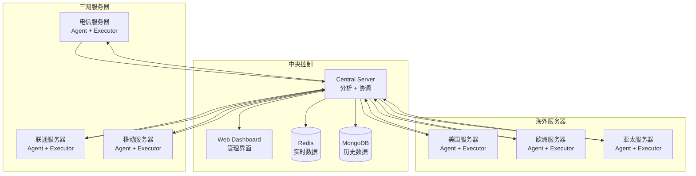

# 🛡️ 分布式Nginx日志监控与Fail2ban封禁系统

[](https://python.org)
[](LICENSE)
[]()

## 📋 项目概述

本项目是一个基于多台服务器的**分布式Nginx日志监控和动态IP封禁系统**，专为三网（电信、联通、移动）和海外主机环境设计，支持CentOS和Ubuntu操作系统。系统通过实时分析Nginx访问日志，自动识别恶意攻击行为，并利用Fail2ban在多个节点间协调执行IP封禁操作。

### 🎯 核心特性

- 🌐 **分布式架构**: 支持多台服务器协同工作，适配三网和海外部署
- ⚡ **实时监控**: 基于文件监控的毫秒级日志分析
- 🧠 **智能分析**: 多种攻击模式识别（SQL注入、XSS、路径遍历、命令注入等）
- 🎯 **动态封禁**: 基于风险评分和机器学习的自动封禁决策
- 📊 **Web界面**: 现代化的管理和监控仪表板
- 🔄 **高可用性**: 支持节点故障恢复和负载均衡
- 📱 **多渠道通知**: 支持邮件、钉钉、微信、Slack等通知方式
- 🔐 **安全加固**: API密钥认证、请求限流、数据加密

## 🏗️ 系统架构



### 🔧 核心组件

#### 1. 中央控制节点 (Central Control Node)
- 📥 接收来自各代理节点的日志数据
- 🔍 执行攻击模式分析和IP风险评估
- 🎛️ 协调各执行节点的封禁操作
- 🌐 提供Web管理界面和RESTful API
- 📊 生成统计报告和可视化图表

#### 2. 日志收集代理 (Log Collection Agent)
- 👁️ 实时监控本地Nginx日志文件
- 📝 解析日志并提取关键信息
- 📤 批量发送日志数据到中央控制节点
- 🔄 支持断线重连和数据重传

#### 3. 封禁执行节点 (Banning Execution Node)
- 📨 接收中央节点的封禁指令
- ⚡ 通过Fail2ban执行实际的IP封禁操作
- 📈 监控封禁状态并反馈执行结果
- 🕒 支持定时解封和白名单管理

## 🛠️ 技术栈

| 组件 | 技术选型 | 版本要求 |
|------|----------|----------|
| **操作系统** | CentOS / Ubuntu | 7/8, 18.04/20.04/22.04 |
| **Web服务器** | Nginx | 1.14+ |
| **封禁工具** | Fail2ban | 0.10+ |
| **编程语言** | Python | 3.7+ |
| **缓存数据库** | Redis | 5.0+ |
| **文档数据库** | MongoDB | 4.0+ |
| **Web框架** | FastAPI | 0.68+ |
| **ASGI服务器** | Uvicorn | 0.15+ |
| **实时通信** | WebSocket | - |
| **文件监控** | Watchdog | 2.1+ |
| **HTTP客户端** | Requests | 2.25+ |

## 🚀 快速开始

### 📋 系统要求

- **操作系统**: Linux (CentOS 7/8 或 Ubuntu 18.04+)
- **Python版本**: 3.7 或更高版本
- **权限要求**: Root权限
- **内存要求**: 至少2GB RAM
- **存储要求**: 至少10GB可用空间
- **网络要求**: 稳定的网络连接

### 📦 一键安装

```bash
# 1. 下载项目
wget https://github.com/your-repo/fail2ban-distributed/archive/main.zip
unzip main.zip
cd fail2ban-distributed-main

# 2. 运行安装脚本
chmod +x install.sh
sudo ./install.sh

# 3. 选择安装模式
# [1] 中央控制节点 - 部署在主控服务器
# [2] 日志收集代理 - 部署在需要监控的服务器
# [3] 封禁执行节点 - 部署在需要执行封禁的服务器
# [4] 全部组件 - 单机部署所有功能
```

### ⚙️ 手动安装

<details>
<summary>点击展开手动安装步骤</summary>

#### 1. 安装系统依赖

**CentOS:**
```bash
yum update -y
yum install -y epel-release
yum install -y python3 python3-pip git nginx fail2ban redis mongodb-server
```

**Ubuntu:**
```bash
apt update
apt install -y python3 python3-pip git nginx fail2ban redis-server mongodb
```

#### 2. 安装Python依赖

```bash
pip3 install -r requirements.txt
```

#### 3. 配置系统

```bash
# 创建系统用户
useradd -r -s /bin/false fail2ban

# 创建目录
mkdir -p /opt/fail2ban /etc/fail2ban-distributed /var/log/fail2ban-distributed

# 复制文件
cp -r ./* /opt/fail2ban/
cp config.example.yaml /etc/fail2ban-distributed/config.yaml

# 设置权限
chown -R fail2ban:fail2ban /opt/fail2ban /var/log/fail2ban-distributed
```

#### 4. 配置服务

```bash
# 复制systemd服务文件
cp scripts/*.service /etc/systemd/system/
systemctl daemon-reload

# 启用并启动服务
systemctl enable --now fail2ban-central
systemctl enable --now fail2ban-web
```

</details>

### 🔧 配置说明

编辑配置文件 `/etc/fail2ban-distributed/config.yaml`：

```yaml
# 系统基础设置
system:
  mode: "central"  # central, agent, executor, all
  node_id: "node-001"
  log_level: "INFO"

# 中央控制节点配置
central:
  api:
    host: "0.0.0.0"
    port: 5000
    api_key: "your-secure-api-key"
  
  database:
    redis:
      host: "localhost"
      port: 6379
    mongodb:
      host: "localhost"
      port: 27017
      database: "fail2ban"

# 分析规则配置
analysis:
  ip_ban:
    max_attempts: 5      # 最大尝试次数
    time_window: 300     # 时间窗口(秒)
    ban_duration: 3600   # 封禁时长(秒)
    risk_threshold: 80.0 # 风险阈值
```

### 🌐 访问Web界面

安装完成后，访问Web管理界面：

- **URL**: `http://your-server-ip:8080`
- **认证**: 使用配置文件中的API密钥

## 📖 详细文档

### 🔍 攻击检测规则

系统内置多种攻击检测规则：

| 攻击类型 | 检测模式 | 示例 |
|----------|----------|------|
| **SQL注入** | 正则匹配 | `union select`, `or 1=1`, `drop table` |
| **XSS攻击** | 正则匹配 | `<script>`, `javascript:`, `onerror=` |
| **路径遍历** | 正则匹配 | `../`, `etc/passwd`, `windows/system32` |
| **命令注入** | 正则匹配 | `; cat`, `| whoami`, `&& ls` |
| **文件包含** | 正则匹配 | `php://`, `file://`, `data://` |
| **频率攻击** | 统计分析 | 高频404、高频请求、目录扫描 |
| **Bot检测** | UA分析 | 恶意爬虫、扫描工具 |

### 📊 风险评分算法

系统采用多维度风险评分机制：

```python
risk_score = (
    attack_patterns * 30 +      # 攻击模式权重
    frequency_score * 25 +       # 频率分析权重
    status_code_score * 20 +     # 状态码权重
    geo_location_score * 15 +    # 地理位置权重
    user_agent_score * 10        # User-Agent权重
)
```

### 🔔 通知配置

支持多种通知方式：

<details>
<summary>邮件通知配置</summary>

```yaml
notifications:
  email:
    enabled: true
    smtp_server: "smtp.gmail.com"
    smtp_port: 587
    username: "your-email@gmail.com"
    password: "your-app-password"
    from_addr: "alert@yourdomain.com"
    to_addrs:
      - "admin@yourdomain.com"
      - "security@yourdomain.com"
```

</details>

<details>
<summary>钉钉通知配置</summary>

```yaml
notifications:
  dingtalk:
    enabled: true
    webhook_url: "https://oapi.dingtalk.com/robot/send?access_token=xxx"
    secret: "your-secret-key"
```

</details>

<details>
<summary>微信通知配置</summary>

```yaml
notifications:
  wechat:
    enabled: true
    corp_id: "your-corp-id"
    corp_secret: "your-corp-secret"
    agent_id: "your-agent-id"
```

</details>

## 🎛️ 使用指南

### 🖥️ 命令行操作

```bash
# 查看服务状态
sudo systemctl status fail2ban-central
sudo systemctl status fail2ban-agent
sudo systemctl status fail2ban-executor

# 查看实时日志
sudo journalctl -u fail2ban-central -f

# 重启服务
sudo systemctl restart fail2ban-central

# 手动运行（调试模式）
cd /opt/fail2ban
python3 main.py --mode central --config /etc/fail2ban-distributed/config.yaml
```

### 📊 Web界面功能

- **📈 实时监控**: 查看攻击趋势和系统状态
- **🚫 IP管理**: 手动封禁/解封IP地址
- **📋 日志查看**: 浏览攻击记录和系统日志
- **🔧 节点管理**: 监控各节点状态和性能
- **⚙️ 规则配置**: 在线调整检测规则和阈值
- **📊 统计报告**: 生成安全分析报告

### 🔌 API接口

系统提供RESTful API接口：

```bash
# 获取系统统计
curl -H "Authorization: Bearer your-api-key" \
     http://localhost:5000/api/stats

# 手动封禁IP
curl -X POST \
     -H "Authorization: Bearer your-api-key" \
     -H "Content-Type: application/json" \
     -d '{"ip":"192.168.1.100","reason":"手动封禁","duration":3600}' \
     http://localhost:5000/api/ban

# 解封IP
curl -X POST \
     -H "Authorization: Bearer your-api-key" \
     -H "Content-Type: application/json" \
     -d '{"ip":"192.168.1.100","reason":"手动解封"}' \
     http://localhost:5000/api/unban
```

## 📁 项目结构

```
fail2ban-distributed/
├── 📄 main.py                 # 主程序入口
├── ⚙️ config.example.yaml     # 配置文件模板
├── 📋 requirements.txt        # Python依赖清单
├── 🚀 install.sh             # 一键安装脚本
├── 🗑️ uninstall.sh           # 卸载脚本
├── 📖 README.md              # 项目文档
│
├── 🏢 central/               # 中央控制节点
│   ├── __init__.py
│   ├── server.py          # 主服务器逻辑
│   └── executor.py        # 执行节点管理
│
├── 🤖 agents/                # 日志收集代理
│   ├── __init__.py
│   └── log_agent.py       # 日志收集器
│
├── 🛠️ utils/                 # 工具模块
│   ├── __init__.py
│   ├── logger.py          # 日志记录工具
│   ├── security.py        # 安全认证工具
│   ├── nginx_parser.py    # Nginx日志解析器
│   └── fail2ban_manager.py # Fail2ban管理器
│
├── 🔍 analysis/              # 智能分析模块
│   ├── __init__.py
│   ├── pattern_detector.py # 攻击模式检测器
│   └── ip_analyzer.py     # IP行为分析器
│
├── 📢 notifications/         # 通知推送模块
│   ├── __init__.py
│   └── notifier.py        # 多渠道通知器
│
└── 🌐 web/                   # Web管理界面
    ├── __init__.py
    └── dashboard.py       # 可视化仪表板
```

## 🔧 高级配置

### 🌍 多节点部署

#### 中央控制节点部署

```bash
# 在主控服务器上
sudo ./install.sh
# 选择模式: [1] 中央控制节点

# 编辑配置
sudo vim /etc/fail2ban-distributed/config.yaml
# 设置 mode: "central"
# 配置数据库连接
# 设置API密钥

# 启动服务
sudo systemctl start fail2ban-central fail2ban-web
```

#### 代理节点部署

```bash
# 在需要监控的服务器上
sudo ./install.sh
# 选择模式: [2] 日志收集代理

# 编辑配置
sudo vim /etc/fail2ban-distributed/config.yaml
# 设置 mode: "agent"
# 配置中央服务器地址
# 设置日志文件路径

# 启动服务
sudo systemctl start fail2ban-agent
```

#### 执行节点部署

```bash
# 在需要执行封禁的服务器上
sudo ./install.sh
# 选择模式: [3] 封禁执行节点

# 编辑配置
sudo vim /etc/fail2ban-distributed/config.yaml
# 设置 mode: "executor"
# 配置中央服务器地址
# 配置Fail2ban路径

# 启动服务
sudo systemctl start fail2ban-executor
```

### 🔐 安全加固

#### SSL/TLS配置

```yaml
# 在config.yaml中启用HTTPS
central:
  api:
    ssl_enabled: true
    ssl_cert: "/path/to/cert.pem"
    ssl_key: "/path/to/key.pem"
  
  websocket:
    ssl_enabled: true
    ssl_cert: "/path/to/cert.pem"
    ssl_key: "/path/to/key.pem"
```

#### 防火墙配置

```bash
# CentOS/RHEL (firewalld)
sudo firewall-cmd --permanent --add-rich-rule="rule family='ipv4' source address='trusted-ip' port protocol='tcp' port='5000' accept"
sudo firewall-cmd --permanent --add-rich-rule="rule family='ipv4' source address='trusted-ip' port protocol='tcp' port='5001' accept"
sudo firewall-cmd --reload

# Ubuntu (ufw)
sudo ufw allow from trusted-ip to any port 5000
sudo ufw allow from trusted-ip to any port 5001
```

### 📊 性能优化

#### 数据库优化

```yaml
# Redis优化配置
central:
  database:
    redis:
      max_connections: 100
      connection_pool_size: 20
      socket_timeout: 5
      socket_connect_timeout: 5

# MongoDB优化配置
    mongodb:
      max_pool_size: 50
      min_pool_size: 5
      max_idle_time_ms: 30000
      server_selection_timeout_ms: 5000
```

#### 日志处理优化

```yaml
# 代理节点优化
agent:
  sender:
    batch_size: 500        # 增加批处理大小
    send_interval: 5       # 减少发送间隔
    max_queue_size: 10000  # 增加队列大小
    compression: true      # 启用压缩
```

## 🔍 监控与运维

### 📈 系统监控

#### 服务状态监控

```bash
#!/bin/bash
# 服务健康检查脚本

services=("fail2ban-central" "fail2ban-agent" "fail2ban-executor" "fail2ban-web")

for service in "${services[@]}"; do
    if systemctl is-active --quiet "$service"; then
        echo "✅ $service is running"
    else
        echo "❌ $service is not running"
        # 发送告警
        systemctl restart "$service"
    fi
done
```

#### 性能监控

```bash
# 查看系统资源使用情况
top -p $(pgrep -f "fail2ban")

# 查看网络连接
netstat -tulpn | grep -E ":(5000|5001|8080)"

# 查看日志文件大小
du -sh /var/log/fail2ban-distributed/

# 查看数据库状态
redis-cli info memory
mongo --eval "db.stats()"
```

### 📋 日志管理

#### 日志轮转配置

```bash
# 创建logrotate配置
sudo tee /etc/logrotate.d/fail2ban-distributed << EOF
/var/log/fail2ban-distributed/*.log {
    daily
    rotate 30
    compress
    delaycompress
    missingok
    notifempty
    create 644 fail2ban fail2ban
    postrotate
        systemctl reload fail2ban-central fail2ban-agent fail2ban-executor
    endscript
}
EOF
```

#### 日志分析

```bash
# 查看封禁统计
grep "IP banned" /var/log/fail2ban-distributed/system.log | wc -l

# 查看最常被封禁的IP
grep "IP banned" /var/log/fail2ban-distributed/system.log | \
    awk '{print $NF}' | sort | uniq -c | sort -nr | head -10

# 查看攻击类型统计
grep "Attack detected" /var/log/fail2ban-distributed/system.log | \
    awk '{print $(NF-1)}' | sort | uniq -c | sort -nr
```

## 🚨 故障排除

### ❗ 常见问题

#### 1. 服务无法启动

**问题**: 服务启动失败

**解决方案**:
```bash
# 查看详细错误信息
sudo journalctl -u fail2ban-central -n 50

# 检查配置文件语法
python3 -c "import yaml; yaml.safe_load(open('/etc/fail2ban-distributed/config.yaml'))"

# 检查端口占用
sudo netstat -tulpn | grep -E ":(5000|5001|8080)"

# 检查权限
sudo ls -la /opt/fail2ban/
sudo ls -la /etc/fail2ban-distributed/
```

#### 2. 节点连接失败

**问题**: 代理或执行节点无法连接到中央服务器

**解决方案**:
```bash
# 测试网络连通性
telnet central-server-ip 5000
telnet central-server-ip 5001

# 检查防火墙设置
sudo iptables -L
sudo firewall-cmd --list-all

# 检查API密钥
grep "api_key" /etc/fail2ban-distributed/config.yaml

# 测试API连接
curl -H "Authorization: Bearer your-api-key" \
     http://central-server-ip:5000/api/health
```

#### 3. 数据库连接问题

**问题**: Redis或MongoDB连接失败

**解决方案**:
```bash
# 检查Redis状态
sudo systemctl status redis
redis-cli ping

# 检查MongoDB状态
sudo systemctl status mongodb
mongo --eval "db.runCommand('ping')"

# 检查数据库配置
grep -A 10 "database:" /etc/fail2ban-distributed/config.yaml

# 重启数据库服务
sudo systemctl restart redis mongodb
```

#### 4. 日志文件监控失败

**问题**: 无法监控Nginx日志文件

**解决方案**:
```bash
# 检查日志文件权限
sudo ls -la /var/log/nginx/

# 检查日志文件路径
grep "log_paths" /etc/fail2ban-distributed/config.yaml

# 测试日志文件读取
sudo -u fail2ban tail -f /var/log/nginx/access.log

# 检查SELinux设置（CentOS）
sudo setsebool -P httpd_can_network_connect 1
sudo setsebool -P httpd_read_user_content 1
```

#### 5. Fail2ban执行失败

**问题**: IP封禁命令执行失败

**解决方案**:
```bash
# 检查Fail2ban状态
sudo systemctl status fail2ban
sudo fail2ban-client status

# 检查jail配置
sudo fail2ban-client status distributed-ban

# 手动测试封禁
sudo fail2ban-client set distributed-ban banip 192.168.1.100
sudo fail2ban-client set distributed-ban unbanip 192.168.1.100

# 检查iptables规则
sudo iptables -L -n
```

### 🔧 调试模式

#### 启用详细日志

```yaml
# 在config.yaml中设置
system:
  log_level: "DEBUG"
  
# 或者临时启用
python3 main.py --mode central --config config.yaml --log-level DEBUG
```

#### 手动测试组件

```bash
# 测试日志解析器
cd /opt/fail2ban
python3 -c "
from utils.nginx_parser import NginxLogParser
parser = NginxLogParser()
result = parser.parse_line('127.0.0.1 - - [01/Jan/2024:00:00:00 +0000] "GET / HTTP/1.1" 200 612')
print(result)
"

# 测试攻击检测
python3 -c "
from analysis.pattern_detector import PatternDetector
detector = PatternDetector()
result = detector.detect_attack('/admin.php?id=1 union select')
print(result)
"

# 测试通知功能
python3 -c "
from notifications.notifier import NotificationManager
config = {'notifications': {'email': {'enabled': False}}}
notifier = NotificationManager(config)
notifier.send_test_notification()
"
```

## 🤝 贡献指南

### 🐛 报告问题

1. 在GitHub上创建Issue
2. 提供详细的错误信息和日志
3. 说明操作系统和版本信息
4. 提供复现步骤

### 💡 功能建议

1. 在GitHub Discussions中讨论新功能
2. 提供详细的需求描述
3. 说明使用场景和预期效果

### 🔧 代码贡献

1. Fork项目到你的GitHub账户
2. 创建功能分支: `git checkout -b feature/new-feature`
3. 提交更改: `git commit -am 'Add new feature'`
4. 推送分支: `git push origin feature/new-feature`
5. 创建Pull Request

### 📝 代码规范

```bash
# 安装开发依赖
pip3 install black flake8 pytest

# 代码格式化
black .

# 代码检查
flake8 .

# 运行测试
pytest tests/
```

## 📄 许可证

本项目采用MIT许可证 - 查看 [LICENSE](LICENSE) 文件了解详情。

## 🙏 致谢

- [Fail2ban](https://www.fail2ban.org/) - 强大的入侵防护工具
- [FastAPI](https://fastapi.tiangolo.com/) - 现代化的Python Web框架
- [Redis](https://redis.io/) - 高性能内存数据库
- [MongoDB](https://www.mongodb.com/) - 灵活的文档数据库
- [Nginx](https://nginx.org/) - 高性能Web服务器

---

<div align="center">
  <p>如果这个项目对你有帮助，请给它一个 ⭐ Star！</p>
  <p>Made with ❤️ by the Fail2ban Distributed Team</p>
</div>

## 许可证

MIT License