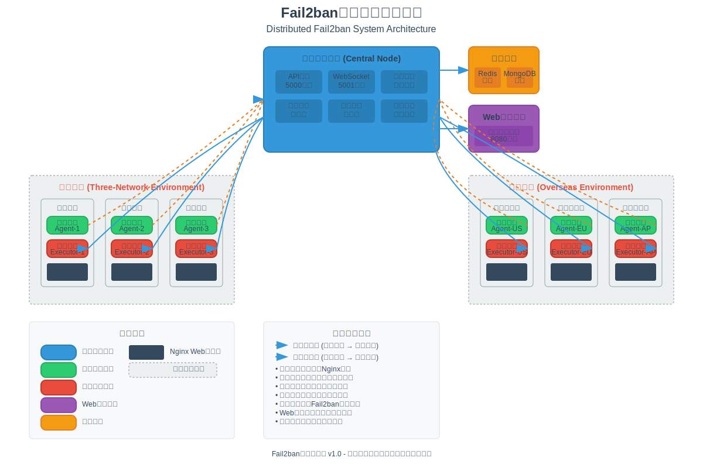

# 用户使用手册

> 📖 本手册提供系统的详细使用指南和运维说明。基础安装请参考 [README.md](../README.md)，系统集成请参考 [INTEGRATION_GUIDE.md](../INTEGRATION_GUIDE.md)

## 目录

1. [生产环境部署](#生产环境部署)
2. [配置管理](#配置管理)
3. [日常使用](#日常使用)
4. [Web管理界面](#web管理界面)
5. [命令行工具](#命令行工具)
6. [监控运维](#监控运维)
7. [故障排除](#故障排除)
8. [性能调优](#性能调优)
9. [安全加固](#安全加固)
10. [FAQ](#faq)

## 快速导航

- **新用户**: 建议先阅读 [README.md](../README.md) 了解系统概述
- **系统集成**: 参考 [INTEGRATION_GUIDE.md](../INTEGRATION_GUIDE.md) 进行部署
- **增强功能**: 查看 [enhancements/README.md](../enhancements/README.md) 了解高级特性
- **API开发**: 参考 [API_REFERENCE.md](../API_REFERENCE.md) 进行接口调用

## 生产环境部署

> 💡 基础安装请参考 [README.md](../README.md#快速开始)，系统集成请参考 [INTEGRATION_GUIDE.md](../INTEGRATION_GUIDE.md)

### 生产环境规划

#### 系统架构图



系统采用分布式架构设计，支持三网环境和海外环境的多节点部署。架构图展示了中央控制节点、增强功能层、代理节点、执行节点以及Web管理界面之间的关系和数据流向。

#### 架构设计原则

- **高可用性**: 关键组件部署多实例，避免单点故障
- **负载均衡**: 合理分配处理负载，提升系统性能
- **安全隔离**: 网络分段，最小权限原则
- **监控告警**: 完善的监控体系和告警机制
- **备份恢复**: 定期备份，快速恢复能力

#### 推荐部署架构

```
生产环境 (推荐配置)
├── 负载均衡层
│   ├── HAProxy/Nginx (2台)
│   └── VIP: 192.168.1.100
├── 应用层
│   ├── 中央控制节点 (2台主备)
│   │   ├── 主节点: 192.168.1.10
│   │   └── 备节点: 192.168.1.11
│   ├── Web界面节点 (2台)
│   │   ├── Web-1: 192.168.1.12
│   │   └── Web-2: 192.168.1.13
│   └── 代理节点 (按需扩展)
├── 数据层
│   ├── Redis集群 (3主3从)
│   └── MongoDB副本集 (3节点)
└── 执行层
    └── 执行节点 (分布式部署)
```

#### 硬件配置建议

| 环境类型 | 中央节点 | Web节点 | 数据库 | 代理节点 | 执行节点 |
|----------|----------|---------|--------|----------|----------|
| 小型环境 | 4核8GB | 2核4GB | 4核8GB | 2核2GB | 1核2GB |
| 中型环境 | 8核16GB | 4核8GB | 8核16GB | 2核4GB | 2核4GB |
| 大型环境 | 16核32GB | 8核16GB | 16核32GB | 4核8GB | 4核8GB |

### 生产环境部署步骤

#### 1. 环境准备清单

**系统要求检查**

```bash
# 检查系统版本
cat /etc/os-release

# 检查Python版本 (需要3.8+)
python3 --version

# 检查网络连通性
ping -c 3 github.com

# 检查防火墙状态
sudo ufw status  # Ubuntu
sudo firewall-cmd --state  # CentOS
```

**安全加固**

```bash
# 1. 创建专用用户
sudo useradd -r -s /bin/false -d /opt/fail2ban fail2ban

# 2. 配置sudo权限 (仅执行节点需要)
echo 'fail2ban ALL=(ALL) NOPASSWD: /usr/bin/fail2ban-client' | sudo tee /etc/sudoers.d/fail2ban

# 3. 设置目录权限
sudo mkdir -p /opt/fail2ban/{bin,config,logs,data}
sudo chown -R fail2ban:fail2ban /opt/fail2ban
sudo chmod 750 /opt/fail2ban
```

#### 2. 数据库集群部署

**Redis集群配置**

```bash
# 主节点配置 (192.168.1.20-22)
sudo tee /etc/redis/redis.conf << EOF
port 6379
bind 0.0.0.0
requirepass your-redis-password
masterauth your-redis-password
cluster-enabled yes
cluster-config-file nodes.conf
cluster-node-timeout 5000
appendonly yes
EOF

# 启动Redis集群
redis-cli --cluster create \
  192.168.1.20:6379 192.168.1.21:6379 192.168.1.22:6379 \
  192.168.1.23:6379 192.168.1.24:6379 192.168.1.25:6379 \
  --cluster-replicas 1 -a your-redis-password
```

**MongoDB副本集配置**

```bash
# 主节点配置 (192.168.1.30-32)
sudo tee /etc/mongod.conf << EOF
net:
  port: 27017
  bindIp: 0.0.0.0
security:
  authorization: enabled
replication:
  replSetName: "fail2ban-rs"
EOF

# 初始化副本集
mongo --eval '
rs.initiate({
  _id: "fail2ban-rs",
  members: [
    {_id: 0, host: "192.168.1.30:27017"},
    {_id: 1, host: "192.168.1.31:27017"},
    {_id: 2, host: "192.168.1.32:27017"}
  ]
})'
```

#### 3. 负载均衡配置

**HAProxy配置示例**

```bash
# /etc/haproxy/haproxy.cfg
global
    daemon
    maxconn 4096
    log stdout local0

defaults
    mode http
    timeout connect 5000ms
    timeout client 50000ms
    timeout server 50000ms
    option httplog

frontend fail2ban_api
    bind *:5000
    default_backend central_nodes

frontend fail2ban_web
    bind *:8080
    default_backend web_nodes

backend central_nodes
    balance roundrobin
    option httpchk GET /api/health
    server central1 192.168.1.10:5000 check
    server central2 192.168.1.11:5000 check backup

backend web_nodes
    balance roundrobin
    option httpchk GET /health
    server web1 192.168.1.12:8080 check
    server web2 192.168.1.13:8080 check
```

**Keepalived高可用配置**

```bash
# /etc/keepalived/keepalived.conf (主节点)
vrrp_instance VI_1 {
    state MASTER
    interface eth0
    virtual_router_id 51
    priority 100
    advert_int 1
    authentication {
        auth_type PASS
        auth_pass your-password
    }
    virtual_ipaddress {
        192.168.1.100
    }
}
```

#### 4. 应用服务部署

**中央控制节点部署**

```bash
# 在主控服务器(192.168.1.10-11)上执行

# 1. 部署应用
sudo python main.py --init-config --mode central
sudo systemctl start fail2ban-central
sudo systemctl enable fail2ban-central

# 2. 验证服务
curl http://localhost:5000/api/health

# 3. 配置主备切换
sudo tee /etc/fail2ban/cluster.yaml << EOF
cluster:
  enabled: true
  node_id: "central-01"
  role: "primary"  # primary/secondary
  peers:
    - "192.168.1.11:5000"
  election_timeout: 5000
  heartbeat_interval: 1000
EOF
```

**Web界面节点部署**

```bash
# 在Web服务器(192.168.1.12-13)上执行

# 1. 部署Web服务
sudo python main.py --init-config --mode web
sudo systemctl start fail2ban-web
sudo systemctl enable fail2ban-web

# 2. 配置反向代理
sudo tee /etc/nginx/sites-available/fail2ban << EOF
server {
    listen 8080;
    server_name _;
    
    location / {
        proxy_pass http://127.0.0.1:8081;
        proxy_set_header Host \$host;
        proxy_set_header X-Real-IP \$remote_addr;
        proxy_set_header X-Forwarded-For \$proxy_add_x_forwarded_for;
    }
    
    location /ws {
        proxy_pass http://127.0.0.1:8081;
        proxy_http_version 1.1;
        proxy_set_header Upgrade \$http_upgrade;
        proxy_set_header Connection "upgrade";
    }
}
EOF

sudo ln -s /etc/nginx/sites-available/fail2ban /etc/nginx/sites-enabled/
sudo nginx -t && sudo systemctl reload nginx
```

#### 步骤2: 部署代理节点

```bash
# 在Web服务器(192.168.1.20-30)上执行

# 1. 安装代理
sudo ./install.sh
# 选择: [2] 日志收集代理

# 2. 配置代理
sudo tee /etc/fail2ban-distributed/config.yaml << EOF
system:
  mode: "agent"
  log_level: "INFO"
  api_key: "your-central-api-key"  # 与中央节点相同

agent:
  central_server:
    host: "192.168.1.10"
    port: 5000
    ssl_enabled: false
  
  log_monitor:
    log_paths:
      - "/var/log/nginx/access.log"
      - "/var/log/nginx/error.log"
    log_format: "nginx_combined"
    check_interval: 1
    batch_size: 100
  
  sender:
    send_interval: 5
    max_queue_size: 1000
    compression: true
EOF

# 3. 配置日志权限
sudo usermod -a -G adm fail2ban
sudo chmod 644 /var/log/nginx/*.log

# 4. 启动服务
sudo systemctl start fail2ban-agent
sudo systemctl enable fail2ban-agent
```

#### 步骤3: 部署执行节点

```bash
# 在防火墙服务器(192.168.1.40-50)上执行

# 1. 安装执行节点
sudo ./install.sh
# 选择: [3] 封禁执行节点

# 2. 配置Fail2ban
sudo tee /etc/fail2ban/jail.d/distributed-ban.conf << EOF
[distributed-ban]
enabled = true
filter = distributed-ban
action = iptables-multiport[name=distributed-ban, port="http,https"]
logpath = /var/log/fail2ban-distributed/bans.log
maxretry = 1
bantime = 3600
findtime = 60
EOF

# 3. 配置执行节点
sudo tee /etc/fail2ban-distributed/config.yaml << EOF
system:
  mode: "executor"
  log_level: "INFO"
  api_key: "your-central-api-key"  # 与中央节点相同

executor:
  central_server:
    host: "192.168.1.10"
    port: 5000
    ssl_enabled: false
  
  fail2ban:
    client_path: "/usr/bin/fail2ban-client"
    jail_name: "distributed-ban"
    config_path: "/etc/fail2ban"
EOF

# 4. 启动服务
sudo systemctl start fail2ban fail2ban-executor
sudo systemctl enable fail2ban fail2ban-executor
```

### 自动化部署脚本

创建集群部署配置文件：

```yaml
# deploy-config.yaml
cluster:
  central:
    host: "192.168.1.10"
    components: ["central", "web"]
  
  agents:
    - host: "192.168.1.20"
      log_paths: ["/var/log/nginx/access.log"]
    - host: "192.168.1.21"
      log_paths: ["/var/log/nginx/access.log"]
  
  executors:
    - host: "192.168.1.40"
    - host: "192.168.1.41"

security:
  api_key: "auto-generate"
  ssl_enabled: false

database:
  redis_host: "192.168.1.10"
  mongodb_host: "192.168.1.10"
```

使用自动化脚本：

```bash
# 集群部署
./deploy.sh --config deploy-config.yaml --mode cluster

# 验证部署
./deploy.sh --config deploy-config.yaml --verify

# 单机部署
./deploy.sh --mode single --host 192.168.1.100
```

## 配置管理

> 💡 基础配置请参考 [README.md](../README.md#配置说明)，系统集成配置请参考 [INTEGRATION_GUIDE.md](../INTEGRATION_GUIDE.md#配置集成)

### 配置文件管理

#### 配置文件层次结构

```
配置管理体系
├── 全局配置
│   ├── /etc/fail2ban/config.yaml (主配置)
│   ├── /etc/fail2ban/cluster.yaml (集群配置)
│   └── /etc/fail2ban/security.yaml (安全配置)
├── 环境配置
│   ├── config.prod.yaml (生产环境)
│   ├── config.test.yaml (测试环境)
│   └── config.dev.yaml (开发环境)
├── 节点配置
│   ├── central.yaml (中央节点)
│   ├── agent.yaml (代理节点)
│   └── executor.yaml (执行节点)
└── 业务配置
    ├── rules/ (检测规则)
    ├── notifications/ (通知模板)
    └── policies/ (封禁策略)
```

#### 配置版本管理

```bash
# 1. 配置文件版本控制
cd /etc/fail2ban
git init
git add .
git commit -m "Initial configuration"

# 2. 配置变更管理
# 修改配置前先备份
sudo cp config.yaml config.yaml.$(date +%Y%m%d_%H%M%S)

# 3. 配置验证
sudo python main.py --validate-config --config config.yaml

# 4. 配置热重载
sudo systemctl reload fail2ban-central
```

### 系统配置详解

#### 基础系统配置

```yaml
system:
  mode: "central"              # 运行模式: central, agent, executor, all, enhanced
  log_level: "INFO"            # 日志级别: DEBUG, INFO, WARNING, ERROR
  api_key: "your-api-key"      # API密钥 (32字符)
  secret_key: "your-secret"    # 加密密钥 (32字符)
  timezone: "Asia/Shanghai"    # 时区设置
  max_workers: 4               # 最大工作线程数
  debug: false                 # 调试模式
  
  # 进程管理
  process:
    pid_file: "/var/run/fail2ban-distributed.pid"
    user: "fail2ban"
    group: "fail2ban"
    umask: "0022"
```

#### 中央控制节点详细配置

```yaml
central:
  # API服务配置
  api:
    host: "0.0.0.0"             # 监听地址
    port: 5000                  # 监听端口
    ssl_enabled: false          # 启用SSL
    ssl_cert: "/path/to/cert.pem"
    ssl_key: "/path/to/key.pem"
    cors_enabled: true          # 启用CORS
    rate_limit: 100             # 请求速率限制 (每分钟)
    timeout: 30                 # 请求超时时间
    
  # WebSocket配置
  websocket:
    host: "0.0.0.0"
    port: 5001
    ssl_enabled: false
    max_connections: 100
    heartbeat_interval: 30
    
  # 数据库配置
  database:
    redis:
      host: "localhost"
      port: 6379
      password: ""
      db: 0
      max_connections: 50
      connection_pool_size: 10
      socket_timeout: 5
      socket_connect_timeout: 5
      retry_on_timeout: true
      
    mongodb:
      host: "localhost"
      port: 27017
      database: "fail2ban_distributed"
      username: "fail2ban"
      password: "your-password"
      auth_source: "admin"
      max_pool_size: 50
      min_pool_size: 5
      max_idle_time_ms: 30000
      server_selection_timeout_ms: 5000
      
  # 封禁策略
  ban_policy:
    default_ban_time: 3600      # 默认封禁时间(秒)
    max_ban_time: 86400         # 最大封禁时间
    min_ban_time: 300           # 最小封禁时间
    risk_threshold: 80          # 风险评分阈值
    attack_threshold: 5         # 攻击次数阈值
    ban_time_increment: 2       # 封禁时间递增倍数
    whitelist_enabled: true     # 启用白名单
    auto_unban: true            # 自动解封
    
  # 集群配置
  cluster:
    enabled: false
    node_id: "central-01"
    discovery_method: "static"  # static, consul, etcd
    nodes:
      - "192.168.1.10:5000"
      - "192.168.1.11:5000"
```

#### 代理节点详细配置

```yaml
agent:
  # 中央服务器连接
  central_server:
    host: "192.168.1.10"
    port: 5000
    ssl_enabled: false
    ssl_verify: true
    timeout: 10
    retry_interval: 5
    max_retries: 3
    
  # 日志监控配置
  log_monitor:
    log_paths:
      - path: "/var/log/nginx/access.log"
        format: "nginx_combined"
        encoding: "utf-8"
      - path: "/var/log/apache2/access.log"
        format: "apache_combined"
        encoding: "utf-8"
    
    # 监控参数
    check_interval: 1           # 检查间隔(秒)
    batch_size: 100             # 批处理大小
    max_line_length: 4096       # 最大行长度
    buffer_size: 8192           # 缓冲区大小
    follow_rotated: true        # 跟踪轮转日志
    
  # 数据发送配置
  sender:
    send_interval: 5            # 发送间隔(秒)
    max_queue_size: 1000        # 最大队列大小
    compression: true           # 启用压缩
    compression_level: 6        # 压缩级别
    batch_timeout: 30           # 批处理超时
    
  # 本地缓存
  cache:
    enabled: true
    max_size: 10000             # 最大缓存条目
    expire_time: 300            # 缓存过期时间
```

#### 执行节点详细配置

```yaml
executor:
  # 中央服务器连接
  central_server:
    host: "192.168.1.10"
    port: 5000
    ssl_enabled: false
    heartbeat_interval: 30
    
  # Fail2ban配置
  fail2ban:
    client_path: "/usr/bin/fail2ban-client"
    jail_name: "distributed-ban"
    config_path: "/etc/fail2ban"
    socket_path: "/var/run/fail2ban/fail2ban.sock"
    timeout: 10
    
  # 执行配置
  execution:
    max_concurrent: 10          # 最大并发执行数
    timeout: 30                 # 执行超时时间
    retry_count: 3              # 重试次数
    retry_delay: 5              # 重试延迟
    
  # 本地防火墙
  firewall:
    type: "iptables"            # iptables, firewalld, ufw
    chain: "INPUT"
    target: "DROP"
    interface: "eth0"
```

#### Web界面配置

```yaml
web:
  # 基础配置
  enabled: true
  host: "0.0.0.0"
  port: 8080
  ssl_enabled: false
  ssl_cert: "/path/to/cert.pem"
  ssl_key: "/path/to/key.pem"
  
  # 认证配置
  auth:
    enabled: true
    session_timeout: 3600       # 会话超时(秒)
    max_login_attempts: 5       # 最大登录尝试次数
    lockout_duration: 300       # 锁定时间(秒)
    
    # 用户配置
    users:
      admin:
        password_hash: "$2b$12$..."
        role: "admin"
        permissions: ["read", "write", "admin"]
      operator:
        password_hash: "$2b$12$..."
        role: "operator"
        permissions: ["read", "write"]
  
  # 界面配置
  ui:
    theme: "dark"               # light, dark
    language: "zh-CN"           # zh-CN, en-US
    refresh_interval: 30        # 自动刷新间隔(秒)
    max_log_lines: 1000         # 最大日志显示行数
    chart_data_points: 100      # 图表数据点数
    
  # 功能配置
  features:
    real_time_updates: true     # 实时更新
    export_enabled: true        # 导出功能
    bulk_operations: true       # 批量操作
    advanced_filters: true      # 高级过滤
```

### 通知配置详解

```yaml
notifications:
  # 全局配置
  global:
    enabled: true
    rate_limit: 10              # 每分钟最大通知数
    retry_count: 3              # 重试次数
    retry_delay: 5              # 重试延迟(秒)
    
  # 邮件通知
  email:
    enabled: true
    smtp_server: "smtp.example.com"
    smtp_port: 587
    username: "your-email@example.com"
    password: "your-password"
    from_email: "fail2ban@example.com"
    to_emails:
      - "admin@example.com"
      - "security@example.com"
    use_tls: true
    use_ssl: false
    timeout: 30
    
    # 邮件模板
    templates:
      attack_detected: "templates/attack_email.html"
      ip_banned: "templates/ban_email.html"
      system_alert: "templates/alert_email.html"
  
  # 钉钉通知
  dingtalk:
    enabled: true
    webhook_url: "https://oapi.dingtalk.com/robot/send?access_token=your-token"
    secret: "your-secret"
    at_all: false
    at_mobiles: ["13800138000"]
    
  # 微信通知
  wechat:
    enabled: true
    webhook_url: "https://qyapi.weixin.qq.com/cgi-bin/webhook/send?key=your-key"
    mentioned_list: ["@all"]
    
  # Slack通知
  slack:
    enabled: false
    webhook_url: "https://hooks.slack.com/services/..."
    channel: "#security"
    username: "Fail2ban"
    icon_emoji: ":shield:"
    
  # 企业微信
  wecom:
    enabled: false
    corp_id: "your-corp-id"
    corp_secret: "your-corp-secret"
    agent_id: "your-agent-id"
    to_user: "@all"
    
  # 通知规则
  rules:
    attack_detected:
      enabled: true
      channels: ["email", "dingtalk"]
      severity: "medium"
      throttle: 60              # 节流时间(秒)
      
    ip_banned:
      enabled: true
      channels: ["dingtalk"]
      severity: "high"
      throttle: 30
      
    system_error:
      enabled: true
      channels: ["email", "slack"]
      severity: "critical"
      throttle: 0
```

### 检测规则详细配置

```yaml
detection:
  # 攻击模式检测
  patterns:
    enabled: true
    
    # 启用的检测类型
    enabled_types:
      - "sql_injection"
      - "xss"
      - "path_traversal"
      - "command_injection"
      - "file_inclusion"
      - "scanner"
      - "brute_force"
      - "bot_detection"
      - "ddos_detection"
    
    # SQL注入检测
    sql_injection:
      enabled: true
      patterns:
        - "union.*select"
        - "drop.*table"
        - "insert.*into"
        - "update.*set"
        - "delete.*from"
      case_sensitive: false
      score: 90
      
    # XSS检测
    xss:
      enabled: true
      patterns:
        - "<script"
        - "javascript:"
        - "onload="
        - "onerror="
      score: 85
      
    # 路径遍历检测
    path_traversal:
      enabled: true
      patterns:
        - "\.\./"
        - "\\.\\.\\" 
        - "/etc/passwd"
        - "/proc/"
      score: 80
  
  # 频率检测
  frequency:
    enabled: true
    
    # 高频请求检测
    high_frequency:
      enabled: true
      window: 60                # 时间窗口(秒)
      threshold: 100            # 请求阈值
      score: 70
      
    # 404错误检测
    error_404:
      enabled: true
      window: 300
      threshold: 20
      rate_threshold: 50        # 错误率阈值(%)
      score: 60
      
    # 爆破检测
    brute_force:
      enabled: true
      window: 300
      threshold: 10
      paths:
        - "/admin"
        - "/login"
        - "/wp-admin"
      score: 95
  
  # 地理位置检测
  geolocation:
    enabled: true
    blocked_countries: ["CN", "RU", "KP"]
    allowed_countries: ["US", "CA", "GB"]
    score: 50
    
  # User-Agent检测
  user_agent:
    enabled: true
    blocked_patterns:
      - "bot"
      - "crawler"
      - "scanner"
    suspicious_patterns:
      - "curl"
      - "wget"
    score: 40
    
  # 风险评分
  scoring:
    enabled: true
    algorithm: "weighted"       # weighted, neural_network
    weights:
      pattern_match: 0.4
      frequency: 0.3
      geolocation: 0.2
      user_agent: 0.1
    threshold: 80               # 封禁阈值
    decay_factor: 0.9           # 分数衰减因子
```

## 使用指南

### 启动系统

#### 启动所有服务

```bash
# 启动中央控制服务
sudo systemctl start fail2ban-central

# 启动Web界面
sudo systemctl start fail2ban-web

# 启动代理服务(在代理节点上)
sudo systemctl start fail2ban-agent

# 启动执行服务(在执行节点上)
sudo systemctl start fail2ban-executor
```

#### 设置开机自启

```bash
sudo systemctl enable fail2ban-central
sudo systemctl enable fail2ban-web
sudo systemctl enable fail2ban-agent
sudo systemctl enable fail2ban-executor
```

### 命令行操作

#### 查看系统状态

```bash
# 使用监控脚本
./monitor.sh status

# 查看详细信息
./monitor.sh status -d

# 实时监控面板
./monitor.sh dashboard -w
```

#### 手动封禁IP

```bash
# 使用API
curl -X POST http://localhost:5000/api/ban \
  -H "Authorization: Bearer your-api-key" \
  -H "Content-Type: application/json" \
  -d '{
    "ip": "192.168.1.100",
    "duration": 3600,
    "reason": "Manual ban"
  }'

# 使用Python脚本
python3 -c "
import requests
response = requests.post(
    'http://localhost:5000/api/ban',
    headers={'Authorization': 'Bearer your-api-key'},
    json={'ip': '192.168.1.100', 'duration': 3600}
)
print(response.json())
"
```

#### 查看封禁列表

```bash
# 获取当前封禁的IP
curl -H "Authorization: Bearer your-api-key" \
     http://localhost:5000/api/banned-ips

# 查看特定IP详情
curl -H "Authorization: Bearer your-api-key" \
     http://localhost:5000/api/ip/192.168.1.100
```

#### 解封IP

```bash
curl -X POST http://localhost:5000/api/unban \
  -H "Authorization: Bearer your-api-key" \
  -H "Content-Type: application/json" \
  -d '{"ip": "192.168.1.100"}'
```

### 日志管理

#### 查看系统日志

```bash
# 查看系统日志
tail -f /var/log/fail2ban-distributed/system.log

# 查看错误日志
tail -f /var/log/fail2ban-distributed/error.log

# 使用监控脚本查看日志
./monitor.sh logs -n 100
```

#### 日志分析

```bash
# 统计封禁次数
grep "IP banned" /var/log/fail2ban-distributed/system.log | wc -l

# 查看最常被封禁的IP
grep "IP banned" /var/log/fail2ban-distributed/system.log | \
  awk '{print $NF}' | sort | uniq -c | sort -nr | head -10

# 查看攻击类型统计
grep "Attack detected" /var/log/fail2ban-distributed/system.log | \
  awk '{print $(NF-1)}' | sort | uniq -c | sort -nr
```

## Web管理界面

### 访问界面

默认访问地址：`http://your-server:8080`

默认登录信息：
- 用户名：admin
- 密码：在配置文件中设置

### 主要功能

#### 1. 仪表板

- **系统概览**: 显示总体统计信息
- **实时监控**: 实时显示攻击事件和封禁操作
- **趋势图表**: 攻击趋势和封禁趋势图
- **节点状态**: 显示所有节点的在线状态

#### 2. IP管理

- **封禁列表**: 查看当前封禁的IP列表
- **手动封禁**: 手动添加IP到封禁列表
- **批量操作**: 支持批量封禁和解封
- **白名单管理**: 管理IP白名单

#### 3. 攻击分析

- **攻击事件**: 查看最近的攻击事件
- **攻击统计**: 按类型、来源、时间统计攻击
- **地理分布**: 攻击来源的地理分布图
- **趋势分析**: 攻击趋势和模式分析

#### 4. 节点管理

- **节点列表**: 查看所有节点状态
- **性能监控**: 监控节点CPU、内存使用情况
- **日志查看**: 查看各节点的日志
- **配置管理**: 远程配置节点参数

#### 5. 系统设置

- **封禁策略**: 配置封禁规则和阈值
- **检测规则**: 管理攻击检测规则
- **通知设置**: 配置通知渠道和规则
- **用户管理**: 管理Web界面用户

### 实时功能

#### WebSocket连接

界面通过WebSocket实现实时更新：

- 实时攻击事件推送
- 实时封禁状态更新
- 实时统计数据刷新
- 实时节点状态监控

#### 自动刷新

- 统计数据每30秒自动刷新
- 节点状态每10秒检查一次
- 攻击事件实时推送
- 图表数据动态更新

## 命令行工具

### 主程序

```bash
# 启动中央控制节点
python3 main.py --mode central --config /path/to/config.yaml

# 启动代理节点
python3 main.py --mode agent --config /path/to/config.yaml

# 启动执行节点
python3 main.py --mode executor --config /path/to/config.yaml

# 启动所有组件
python3 main.py --mode all --config /path/to/config.yaml

# 调试模式
python3 main.py --mode central --log-level DEBUG
```

### 监控脚本

```bash
# 查看服务状态
./monitor.sh status

# 查看性能指标
./monitor.sh performance

# 查看日志
./monitor.sh logs -n 100

# 查看统计信息
./monitor.sh stats

# 健康检查
./monitor.sh health

# 实时监控面板
./monitor.sh dashboard -w

# JSON格式输出
./monitor.sh status -f json
```

### 测试脚本

```bash
# 运行所有测试
./test.sh

# 运行单元测试
./test.sh unit

# 运行API测试
./test.sh api --host 192.168.1.10

# 运行性能测试
./test.sh performance -v

# 运行安全测试
./test.sh security
```

### 部署脚本

```bash
# 单机部署
./quick-deploy.sh

# 集群部署
./quick-deploy.sh -m cluster -c deploy-config.yaml

# 预览部署操作
./quick-deploy.sh --dry-run

# 强制覆盖安装
./quick-deploy.sh --force
```

## 监控运维

### 系统监控

#### 服务状态监控

```bash
# 检查所有服务状态
for service in fail2ban-central fail2ban-agent fail2ban-executor fail2ban-web; do
    echo "$service: $(systemctl is-active $service)"
done

# 查看服务详细状态
sudo systemctl status fail2ban-central
```

#### 性能监控

```bash
# 查看系统资源使用
top -p $(pgrep -f "fail2ban")

# 查看内存使用
ps aux | grep -E "fail2ban|python3.*main.py" | awk '{sum+=$6} END {print "Total Memory: " sum/1024 " MB"}'

# 查看网络连接
netstat -tulpn | grep -E ":(5000|5001|8080)"
```

#### 数据库监控

```bash
# Redis监控
redis-cli info memory
redis-cli info stats

# MongoDB监控
mongo --eval "db.stats()"
mongo --eval "db.serverStatus()"
```

### 日志轮转

配置logrotate自动轮转日志：

```bash
# 创建logrotate配置
sudo tee /etc/logrotate.d/fail2ban-distributed << EOF
/var/log/fail2ban-distributed/*.log {
    daily
    rotate 30
    compress
    delaycompress
    missingok
    notifempty
    create 644 fail2ban fail2ban
    postrotate
        systemctl reload fail2ban-central fail2ban-agent fail2ban-executor
    endscript
}
EOF
```

### 备份策略

#### 配置文件备份

```bash
#!/bin/bash
# 备份配置文件
BACKUP_DIR="/backup/fail2ban-$(date +%Y%m%d)"
mkdir -p "$BACKUP_DIR"

# 备份配置
cp -r /etc/fail2ban-distributed "$BACKUP_DIR/"

# 备份数据库
mongodump --out "$BACKUP_DIR/mongodb"
redis-cli --rdb "$BACKUP_DIR/redis.rdb"

# 压缩备份
tar -czf "$BACKUP_DIR.tar.gz" "$BACKUP_DIR"
rm -rf "$BACKUP_DIR"
```

#### 自动备份

```bash
# 添加到crontab
echo "0 2 * * * /path/to/backup.sh" | crontab -
```

### 告警配置

#### 系统告警脚本

```bash
#!/bin/bash
# 系统健康检查和告警

check_service() {
    local service=$1
    if ! systemctl is-active --quiet "$service"; then
        echo "ALERT: Service $service is down" | mail -s "Fail2ban Alert" admin@example.com
    fi
}

check_service "fail2ban-central"
check_service "fail2ban-web"
check_service "redis"
check_service "mongodb"

# 检查磁盘空间
DISK_USAGE=$(df /var/log | tail -1 | awk '{print $5}' | cut -d'%' -f1)
if [ $DISK_USAGE -gt 90 ]; then
    echo "ALERT: Disk usage is ${DISK_USAGE}%" | mail -s "Disk Space Alert" admin@example.com
fi
```

## 故障排除

### 常见问题

#### 1. 服务无法启动

**症状**: systemctl start 失败

**排查步骤**:

```bash
# 查看详细错误信息
sudo journalctl -u fail2ban-central -n 50

# 检查配置文件语法
python3 -c "import yaml; yaml.safe_load(open('/etc/fail2ban-distributed/config.yaml'))"

# 检查端口占用
sudo netstat -tulpn | grep -E ":(5000|5001|8080)"

# 检查权限
sudo ls -la /opt/fail2ban/
sudo ls -la /etc/fail2ban-distributed/
```

**解决方案**:
- 修复配置文件语法错误
- 释放被占用的端口
- 修正文件权限

#### 2. 节点连接失败

**症状**: 代理或执行节点无法连接到中央服务器

**排查步骤**:

```bash
# 测试网络连通性
telnet central-server-ip 5000

# 检查防火墙
sudo iptables -L
sudo firewall-cmd --list-all

# 检查API密钥
grep "api_key" /etc/fail2ban-distributed/config.yaml

# 测试API连接
curl -H "Authorization: Bearer your-api-key" \
     http://central-server-ip:5000/api/health
```

**解决方案**:
- 配置防火墙规则
- 检查API密钥配置
- 确认网络连通性

#### 3. 数据库连接问题

**症状**: Redis或MongoDB连接失败

**排查步骤**:

```bash
# 检查Redis
sudo systemctl status redis
redis-cli ping

# 检查MongoDB
sudo systemctl status mongodb
mongo --eval "db.runCommand('ping')"

# 检查配置
grep -A 10 "database:" /etc/fail2ban-distributed/config.yaml
```

**解决方案**:
- 重启数据库服务
- 检查数据库配置
- 确认数据库权限

#### 4. 日志监控失败

**症状**: 无法监控Nginx日志文件

**排查步骤**:

```bash
# 检查日志文件权限
sudo ls -la /var/log/nginx/

# 检查配置路径
grep "log_paths" /etc/fail2ban-distributed/config.yaml

# 测试文件读取
sudo -u fail2ban tail -f /var/log/nginx/access.log
```

**解决方案**:
- 修正文件权限
- 确认日志文件路径
- 配置SELinux策略

### 调试模式

#### 启用详细日志

```bash
# 临时启用调试模式
python3 main.py --mode central --log-level DEBUG

# 修改配置文件
sed -i 's/log_level: "INFO"/log_level: "DEBUG"/' /etc/fail2ban-distributed/config.yaml
sudo systemctl restart fail2ban-central
```

#### 手动测试组件

```bash
# 测试日志解析
cd /opt/fail2ban
python3 -c "
from utils.nginx_parser import NginxLogParser
parser = NginxLogParser()
result = parser.parse_line('127.0.0.1 - - [01/Jan/2024:00:00:00 +0000] "GET / HTTP/1.1" 200 612')
print(result)
"

# 测试攻击检测
python3 -c "
from analysis.pattern_detector import PatternDetector
detector = PatternDetector()
result = detector.detect_attack('/admin.php?id=1 union select')
print(result)
"
```

## 最佳实践

### 安全配置

#### 1. 网络安全

```bash
# 限制API访问
sudo firewall-cmd --permanent --add-rich-rule="rule family='ipv4' source address='trusted-network' port protocol='tcp' port='5000' accept"
sudo firewall-cmd --reload

# 配置SSL/TLS
# 在config.yaml中启用SSL
central:
  api:
    ssl_enabled: true
    ssl_cert: "/path/to/cert.pem"
    ssl_key: "/path/to/key.pem"
```

#### 2. 访问控制

```yaml
# 配置IP白名单
security:
  access_control:
    allowed_ips:
      - "192.168.0.0/16"
      - "10.0.0.0/8"
    denied_ips:
      - "192.168.1.100"
```

#### 3. 密钥管理

```bash
# 定期轮换API密钥
API_KEY=$(openssl rand -hex 32)
sed -i "s/api_key: .*/api_key: \"$API_KEY\"/" /etc/fail2ban-distributed/config.yaml

# 使用环境变量
export FAIL2BAN_API_KEY="your-api-key"
```

### 性能优化

#### 1. 数据库优化

```yaml
# Redis优化
central:
  database:
    redis:
      max_connections: 100
      connection_pool_size: 20

# MongoDB优化
    mongodb:
      max_pool_size: 50
      min_pool_size: 5
```

#### 2. 日志处理优化

```yaml
# 代理节点优化
agent:
  sender:
    batch_size: 500
    send_interval: 5
    compression: true
```

#### 3. 缓存策略

```yaml
# 缓存配置
performance:
  cache:
    ip_analysis_size: 10000
    pattern_cache_size: 5000
    expire_time: 1800
```

### 运维建议

#### 1. 监控策略

- 设置关键指标告警
- 定期检查系统健康状态
- 监控数据库性能
- 跟踪封禁效果

#### 2. 备份策略

- 每日备份配置文件
- 定期备份数据库
- 测试备份恢复流程
- 异地备份重要数据

#### 3. 更新策略

- 定期更新系统组件
- 测试新版本兼容性
- 制定回滚计划
- 维护更新日志

## FAQ

### Q1: 如何添加自定义攻击检测规则？

**A**: 编辑配置文件中的检测规则：

```yaml
detection:
  patterns:
    custom_patterns:
      malicious_paths:
        - "/admin/config.php"
        - "/.env"
        - "/config/database.yml"
```

### Q2: 如何调整封禁时间？

**A**: 修改封禁策略配置：

```yaml
central:
  ban_policy:
    default_ban_time: 7200  # 2小时
    max_ban_time: 86400     # 24小时
    ban_time_increment: 2   # 递增倍数
```

### Q3: 如何处理误封问题？

**A**: 
1. 添加IP到白名单
2. 手动解封IP
3. 调整检测阈值
4. 优化检测规则

```bash
# 手动解封
curl -X POST http://localhost:5000/api/unban \
  -H "Authorization: Bearer your-api-key" \
  -d '{"ip": "192.168.1.100"}'
```

### Q4: 如何扩展到更多节点？

**A**: 
1. 在新服务器上安装对应组件
2. 配置连接到中央服务器
3. 启动服务并验证连接
4. 在Web界面查看节点状态

### Q5: 如何备份和恢复系统？

**A**: 
```bash
# 备份
mongodump --out /backup/mongodb
redis-cli --rdb /backup/redis.rdb
cp -r /etc/fail2ban-distributed /backup/

# 恢复
mongorestore /backup/mongodb
redis-cli --rdb /backup/redis.rdb
cp -r /backup/fail2ban-distributed /etc/
```

### Q6: 如何优化系统性能？

**A**: 
1. 调整批处理大小
2. 优化数据库连接池
3. 启用数据压缩
4. 配置缓存策略
5. 定期清理历史数据

### Q7: 如何集成到现有监控系统？

**A**: 
1. 使用API接口获取监控数据
2. 配置Prometheus指标导出
3. 设置Grafana仪表板
4. 集成到SIEM系统

---

如需更多帮助，请参考[API文档](API.md)或联系技术支持团队。